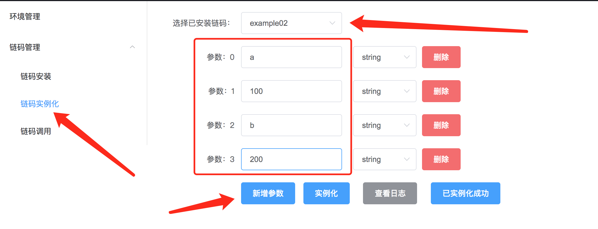

## devplat本地链码测试工具

### 介绍

​		devplat是一款本地链码测试工具，提供了一键部署清理本地fabric开发环境的功能。解决了fabric开发环境搭建的难题。项目参照了fabric-samples中的chaincode-docker-devmode的搭建方式，使用docker-sdk的方式一键集成peer、orderer、cli、couchdb、chaincode等服务。

### 开箱即用

#### 项目启动

​        项目由go mod管理，目前支持fabric-1.4版本。如果您是Mac或者Linux平台，则可做到开箱即用：

> 请保证您的电脑上已经提前安装好go和docker，go版本推荐1.13或以上，docker版本推荐ce-17.06或以上

* 拉取分支代码

```shell
git clone http://192.168.9.251/feizhaohui/devplat.git
```

* 进入项目执行

```shell
# 进入项目目录，执行前请保证8080端口未被占用
go run main.go
```

* 如果服务启动成功，打开浏览器，访问localhost:8080即可展现以下界面


#### 环境管理

##### 镜像拉取

> 提示：请确保您的本机docker已经存在以下图中的四个镜像，可使用docker images进行查看，如果不存在，请执行docker pull 镜像名拉取以下四个镜像，再进行环境启动操作。

```shell
docker pull hyperledger/fabric-tools:latest
docker pull hyperledger/fabric-couchdb:latest
docker pull hyperledger/fabric-orderer:latest
docker pull hyperledger/fabric-peer:latest
```

##### 环境启动

​		点击启动环境，会出现等待提示，项目运行日志会有相关服务启动记录。如图下所示，表示环境启动成功


> 在windows下面可能会出现部分问题，导致项目不能启动fabric环境，相关采坑文档后续更新

##### 环境清理

​      点击清理环境，同样会出现等待提示。如图下所示，表示环境清理成功


#### 链码管理

​        本项目支持链码在线运行测试，链码项目由**devplat/deploy/chaincode**目录管理，如果您需要使用本项目进行链码管理，请您把相关的链码项目提前放置在**devplat/deploy/chaincode**目录中。以下展示如果使用本项目进行example02链码管理。

* 拉取fabric源码
* 拷贝example02目录到**devplat/deploy/chaincode**目录下

> 链码example02此时已经被拷贝到非gopath目录下，因此需要使用go mod进行管理

* 使用go mod管理example02

```shell
go mod init example02  # 使用go mod初始化项目，名称为example02
go mod tidy            # 拉取相关依赖
```


> 在执行go mod tidy的时候，可能会出现依赖冲突，如下图所示


> 解决办法：编辑go.mod文件，添加以下红色圈中的内容。（链码开发版本可以自行制定，目前使用的是1.4.0，最好版本在1.4及以上）


> 添加之后，再次执行go mod tidy命令，相关依赖就可以下载成功了。如果您的拉取过慢，请修改go env中的GOPROXY参数。

* 编译并执行example02

```shell
# 编译
go build 
# 执行
# CORE_PEER_ADDRESS参数：     设置链码需要连接的peer节点，本项目默认开启的peer节点端口是7052
# CORE_CHAINCODE_ID_NAME参数：设置链码名称以及版本，中间使用冒号分割，可随意指定
CORE_PEER_ADDRESS=localhost:7052 CORE_CHAINCODE_ID_NAME=example02:1.0 ./example02
```


> 执行example02链码的时候需要保证环境是正常启动的，否则会因为连接不上peer节点，结束运行


##### 链码安装

* 选择"链码管理" 
* 选择"链码安装" 
* "选择项目安装链码" 选择项目 "example02"
*  填写"链码版本"为"1.0"
* 点击"安装"


> 链码安装之后会给出"链码安装结束"的提示，此时链码安装的日志保存在页面中，点击"查看日志"，如下图所示，出现 status:200 payload:"OK"则表示安装成功


> 提示：查看日志，安装成功之后，需要点击"已安装成功"，进行流程流转

##### 链码实例化

* 选择"链码管理"
* 选择"链码实例化"
* "选择已安装链码"选择"example02"
* 点击"新增参数"，填写四个初始化参数
* 点击"实例化"



> 链码实例化需要example02的运行，如果出现example02实例化时打印出来的日志，则表示实例化成功，如下图所示


> 提示：查看example02运行日志，实例化成功之后，同样需要点击"已实例化成功"，进行流程流转

##### 链码调用

* 选择"链码管理"
* 选择"链码调用"
* "选择已实例化链码"选择"example02"
* 填写链码方法名"invoke"
* 点击"新增参数"，填写invoke方法需要的三个参数
* 点击"调用"


> 链码调用执行之后，example02运行日志会打印出example02链码执行invoke方法时打印出来的日志，则表示调用成功，如下图所示


> 接下来可以使用同样的操作，填写query方法查询链码，添加一个参数a，查询a的结果，如下图所示


##### 实时修改

​      本地开发链码的时候，测试通常不太方便，需要到真正的fabric环境中安装、实例化链码，耗费时间比较长。虽然fabric提供了MockStub可以通过编写测试文件的方式测试链码，但是MockStub不支持couchdb，有一定的局限性。本项目可通过停止链码项目运行->修改链码项目->重新运行链码项目->调用链码->获取新的结果的方式，大大提高链码开发测试的效率。

```shell
# control C停止example02链码运行
# 修改example02.go文件，在第55行，添加一行打印记录
# 保存退出，编译example02
go build
# 重新执行example02
CORE_PEER_ADDRESS=localhost:7052 CORE_CHAINCODE_ID_NAME=example02:1.0 ./example02
```


> 修改重新运行之后，再次执行query查询链码的时候，控制台日志输出多了一行记录，如下图所示


#### 附1：Goland IDE运行链码说明

​        直接用ide打开example02项目，编译执行main方法会出现报错退出的，此时需要设置环境变量，如下图所示，选择右上角的go build example02，打开Environment最右边的那个图标，进行参数配置


> 提示：Environment环境配置了之后，需要先点击"OK"左边的"Apply"才能生效，生效之后重新编译运行就可以成功了。

#### 附2：链码工程化部署说明

​        简单的链码可以只放在一个文件中，但是如果比较复杂的链码，需要工程化项目管理，那么直接在链码安装会发现找不到路径，此时需要生成vendor包

```shell
# 进入链码项目
go mod init 链码项目名
go mod tidy     # 拉取项目包依赖
go mod vendor   # 添加vendor包依赖
go build 
```

> 在IDE编译器中，如果开启了go mod管理，生成了vendor包是会报错找不到路径的，我们只需要在链码安装阶段生成vendor包，链码如果安装成功了之后，是可以随时把vendor包删除的；此后，便可以在IDE中运行链码，在浏览器进行链码实例化和链码调用。

#### 附3：json格式参数的支持

​       项目已经支持在链码实例化和链码调用时传入json格式的参数，只需要在右边string下拉选择框中选择json，将数据填入框内，如下图所示


